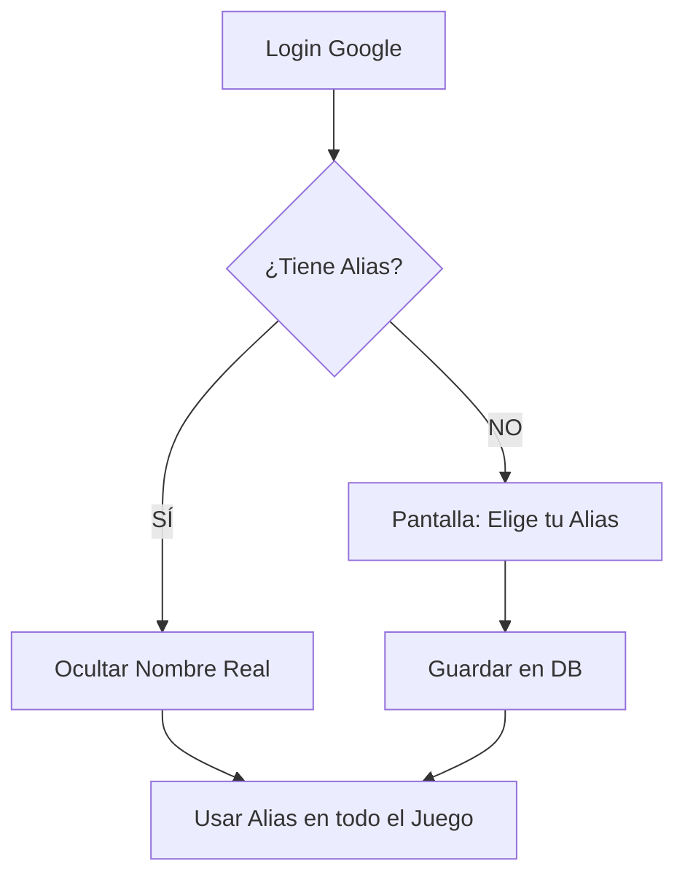

# 🔐 Autenticación y Privacidad

La seguridad y la privacidad de los jugadores son primordiales en Trivia War. El sistema está diseñado para que la identidad real del usuario nunca se filtre a la arena de combate.

## 🛡️ Sistema de Blindaje de Alias

Este es el componente de privacidad más importante. Aunque un usuario se loguee con Google, **su nombre real nunca se muestra a otros jugadores.**

1. **Detección**: Al loguearse, el sistema verifica si el usuario ya tiene un **Alias de Batalla** en Firestore (`mvpp-estadisticas`).
2. **Prioridad**: Si existe un Alias, el servidor **sobrescribe** cualquier nombre real proveniente de Google o Firebase Auth antes de enviar los datos al cliente.
3. **Mantenimiento**: En el Frontend, todos los componentes (Navbar, Lobby, Arena) priorizan la variable `username` (Alias) sobre el `name` (Nombre real).

---

## 🔑 Métodos de Ingreso

### 1. Google Login (Recomendado)
- Utiliza **Firebase Authentication** con el proveedor de Google.
- El servidor valida el `idToken` y sincroniza el perfil con la base de datos local.
- Si es un usuario nuevo, se le redirige a una pantalla de "Bienvenida" para que elija su Alias antes de jugar.

### 2. Correo y Contraseña
- Registro e inicio de sesión clásico gestionado por Firebase.
- Se requiere verificación de correo electrónico para activar la cuenta.

---

## 📊 Persistencia de Datos

Los datos de usuario se dividen en:
- **Firebase Auth**: Maneja las credenciales y el correo.
- **Firestore (`mvpp-estadisticas`)**: Almacena el perfil público (Alias, Avatar) y las estadísticas de juego (Ranking, Puntos).

## 🛡️ Diagrama de Flujo de Privacidad

---
[Volver al Índice](../Indice.md)
