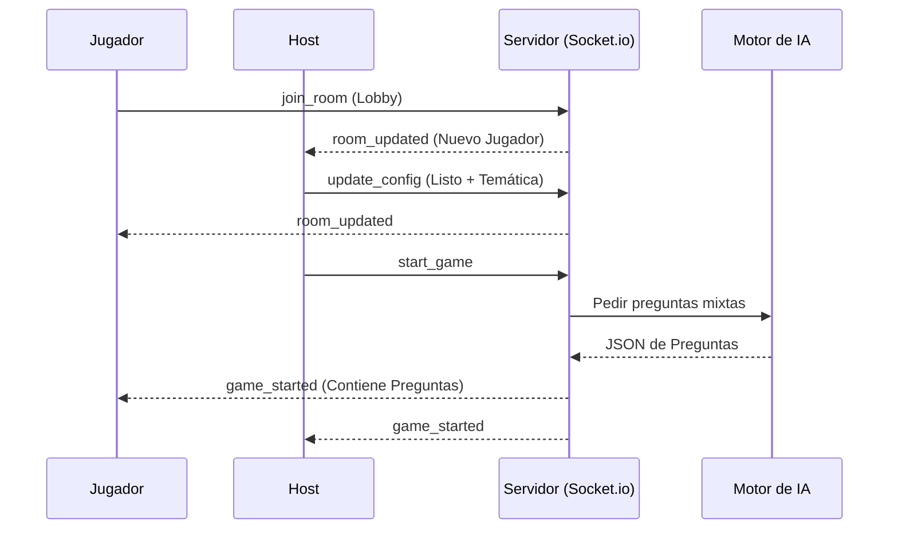

# 🚀 Core Multijugador - WebSockets

El corazón de Trivia War es su capacidad de respuesta inmediata. Utilizamos **Socket.io** para gestionar el estado de las salas y la sincronización entre jugadores.

## 📡 Arquitectura de Eventos

La comunicación se basa en eventos asíncronos que mantienen a todos los clientes sincronizados sin necesidad de recargar la página.

### 1. Gestión de Salas
- `join_room`: Un jugador entra a una sala. El servidor lo añade al grupo y notifica al resto.
- `leave_room`: El jugador sale. Si era el Host, el servidor delega automáticamente el liderazgo al siguiente jugador.
- `room_updated`: Evento emitido por el servidor cada vez que alguien cambia su estado (se pone "Listo" o elige temática).

### 2. Ciclo de Vida de la Partida
1. **Lobby**: Los jugadores emiten `update_config`. Cuando todos están listos, el Host emite `start_game`.
2. **Generación**: El servidor procesa las temáticas y emite `game_started` con el paquete de preguntas de IA.
3. **Sincronización**: Los clientes avanzan por las preguntas localmente, pero emiten sus resultados al final de cada ronda.

---

## 🛠️ Lógica de Sincronización en Tiempo Real

Para evitar trampas y asegurar la fluidez:
- **Estado Volátil**: Las salas activas viven en el `roomService`.
- **Broadcast Inteligente**: Solo se envían actualizaciones a los miembros de la misma sala (`socket.to(roomCode).emit(...)`).
- **Recuperación**: El sistema maneja reconexiones básicas permitiendo que un jugador vuelva a entrar a su sala si el ID coincide.

## 🔄 Diagrama de Flujo (Lobby a Arena)

---
[Volver al Índice](../Indice.md)
