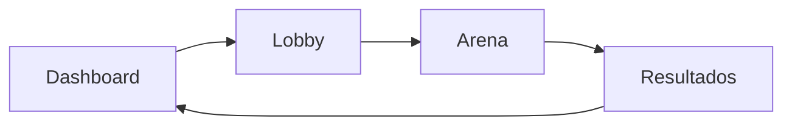

# 🎨 Guía de Componentes Clave

La interfaz de Trivia War está dividida en cuatro grandes áreas funcionales que guían al jugador en su experiencia.

## 🏠 1. Dashboard (El Hub)
Es el punto de partida.
- **Salas Activas**: Un listado en tiempo real de partidas a las que el usuario puede unirse.
- **Acceso Rápido**: Botones para crear sala o entrar en modo entrenamiento.
- **Mini Ranking**: Muestra el Top 3 actual para fomentar la competencia.

## 🤝 2. Lobby (Sala de Espera)
Aquí ocurre la estrategia antes de la batalla.
- **Selector de Temática**: Cada jugador define de qué tratarán sus preguntas.
- **Estado de Preparación**: Los jugadores deben marcarse como "Listos" para que el Host pueda iniciar.
- **Chat**: Comunicación integrada para coordinar con otros guerreros.

## 🏟️ 3. Arena (El Motor de Juego)
Es el componente más complejo.
- **Gestión de Tiempo**: Un cronómetro regresivo de 30 segundos sincronizado.
- **Intermedio de Ronda**: Cada vez que se completa una temática, el juego se pausa 5 segundos para mostrar el ranking parcial, creando tensión.
- **Feedback Visual**: Las opciones cambian de color instantáneamente al responder (verde para acierto, rojo para error).

## 🏆 4. Resultados (El Panteón)
La pantalla final de la partida.
- **Podio**: Muestra al ganador con una estética destacada.
- **Estadísticas de Sala**: Desglose de aciertos y tiempo total de todos los participantes.
- **Ranking Global**: Permite ver cómo ha quedado el usuario respecto a la historia total del juego.

---

## 🛠️ Ciclo de Vida del Jugador

---
[Volver al Índice](../Indice.md)
