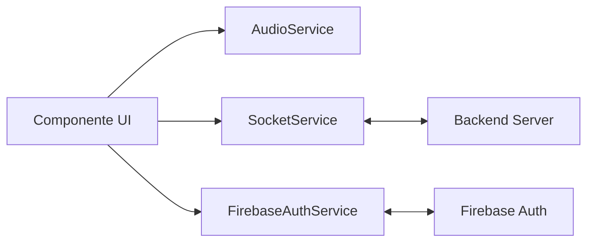

# ⚙️ Servicios de Comunicación y Lógica

Los servicios en el frontend actúan como el puente entre la interfaz de usuario y el servidor o las APIs externas.

## 📡 SocketService (Tiempo Real)

Es el encargado de mantener la conexión persistente con el backend.
- **Eventos Salientes**: `join_room`, `start_game`, `update_config`.
- **Observables Entrantes**: Proporciona flujos de datos (`onRoomUpdated`, `onGameStarted`) a los que los componentes se suscriben para reaccionar a cambios de otros jugadores.

## 🔐 FirebaseAuthService (Seguridad)

Gestiona todo el ciclo de vida del usuario:
- **Login Social**: Integra el popup de Google.
- **Sincronización**: Al loguearse, descarga el perfil desde la API del backend para obtener el Alias y el Avatar.
- **Estado Global**: Expone un `Signal` llamado `usuarioActual` que está disponible en toda la aplicación.

## 🔊 AudioService (Inmersión)

Trivia War no es un juego mudo. Este servicio gestiona:
- **Música de Fondo**: Diferentes temas para el Dashboard, Lobby y Arena.
- **Efectos de Sonido (SFX)**: Clicks, sonidos de respuesta correcta/incorrecta y el sonido de "tiempo agotado".
- **Crossfading**: Transiciones suaves entre canciones para no romper el clima del juego.

---

## 🛠️ Interacción entre Servicios

---
[Volver al Índice](../Indice.md)
